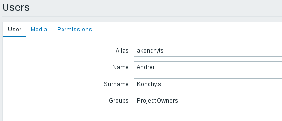
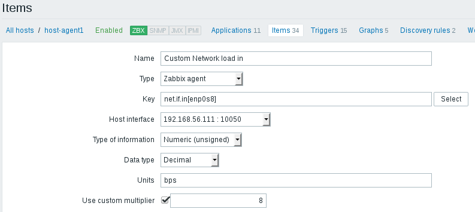
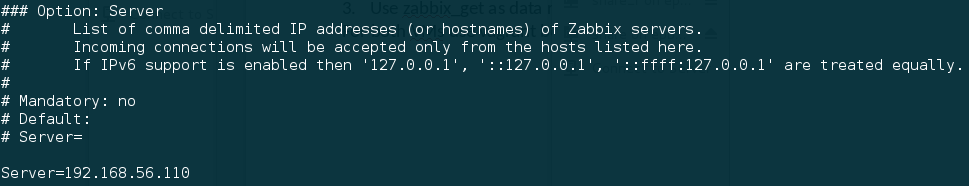

# Task. Zabbix. Basics
### See Vagrantfile and script files for Testing Infrastructure:
*Vagrantfile to spin up 2 VMs (virtualbox):*
  * *zabbix server, provisioned by Vagrant provisioner*
  * *Zabbix agents on both VMs, provisioned by Vagrant provisioner*
*Configure zabbix to work on the server directly without /zabbix*
*http://zabbix-server/zabbix -> http://zabbix-server*

### Task:
**1.** Using Zabbix UI:
  * *Create User group 'Project Owners'*

  
  * *Create User 'Andrei konchyts'), assign user to 'Project Owners', set email*

 
  * *Add 2nd VM to zabbix: create Host group ('Project Hosts'), create Host in this group, enable ZABBIX Agent monitoring*
  

  
  * *Assign to this host template of Linux*
  

  
  * *Create custom checks (CPU Load, Memory load, Free space on file systems, Network load)*
  

  
  * *Create trigger with Severity HIGH, check if it works (Problem/Recovery)*
  

  
  * *Create Action to inform 'Project Owners' if HIGH triggers happen*
  

**2.** Using Zabbix UI:
  * *Configure 'Network discovery' so that, 2nd VM will be joined to Zabbix (group 'Project Hosts', Template 'Template OS Linux')*
  

# Task. Zabbix Tools
### See Vagrantfile and script files for Testing Infrastructure

### Task:
**1.** Configure the agent for replying to the specific server in passive and active mode

**2.** Use zabbix_sender to send data to server manually (use zabbix_sender with key –vv for maximal verbosity)

**3.** Use zabbix_get as data receiver and examine zabbix agent sending’s

