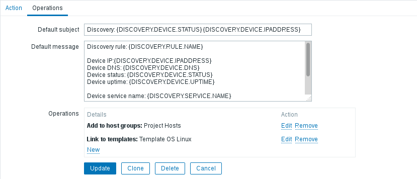

## Task 1. Zabbix. Basics

**Testing Infrastructure:**
Vagrantfile to spin up 2 VMs (virtualbox):
- zabbix server, provisioned by Vagrant provisioner
- Zabbix agents on both VMs, provisioned by Vagrant provisioner
Configure zabbix to work on the server directly without /zabbix
http ://zabbix-server/zabbix -> http://zabbix-server

## Task
  You should install and configure Zabbix server and agents.

**1. Using Zabbix UI:**
  * Create User group “Project Owners”
  

  * Create User (example “Siarhei Beliakou”), assign user to “Project Owners”, set
email
  
  
  

  * Add 2nd VM to zabbix: create Host group (“Project Hosts”), create Host in this
group, enable ZABBIX Agent monitoring
  
  

  * Assign to this host template of Linux
  

  * Create custom checks (CPU Load, Memory load, Free space on file systems, Network load)
      custom keys:
        system.cpu.load[ ,]
        proc.mem[,sum]
        vfs.fs.size[/,free]
        net.if.in[enp0s8]
        net.if.out[enp0s8]
      Example:
      

  * Create trigger with Severity HIGH, check if it works (Problem/Recovery)
    

  * Create Action to inform “Project Owners” if HIGH triggers happen
  
  
  
  
  

  For both VMs use vagrant box “sbeliakou/centos-7.3-x86_64-minimal”

  **2. Using Zabbix UI:**
  * Configure “Network discovery” so that, 2nd VM will be joined to Zabbix (group “Project Hosts”, Template “Template OS Linux”)
  
  !
  
  
  
  

## Task. Zabbix Tools

**Testing Infrastructure:**
Vagrantfile to spin up 2 VMs (virtualbox):
 - zabbix server, provisioned by Vagrant provisioner
 - Linux VM with zabbix agent, script for registration on zabbix server, all provisioned by Vagrant provisioner

## Task

  * Configure the agent for replying to the specific server in passive and active mode.

  * Use zabbix_sender to send data to server manually (use zabbix_sender with key –vv for maximal verbosity).
  
  
  
  

  * Use zabbix_get as data receiver and examine zabbix agent sending’s.
  
For both VMs use vagrant box “sbeliakou/centos-7.3-x86_64-minimal”
