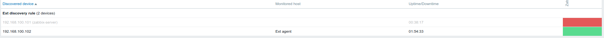

# Report Here  
## Using Zabbix UI  
Create User group “Project Owners”  

Create User (example “Siarhei Beliakou”), assign user to “Project Owners”, set email  

Assign to this host template of Linux  

Create custom checks (CPU Load, Memory load, Free space on file systems, Network load)  
Create trigger with Severity HIGH, check if it works (Problem/Recovery)  

Configure “Network discovery” so that, 2nd VM will be joined to Zabbix (group “Project Hosts”, Template “Template OS Linux”)  

Use zabbix\_sender to send data to server manually (use zabbix\_sender with key –vv for maximal verbosity)  

Use zabbix\_get as data receiver and examine zabbix agent sending’s  

