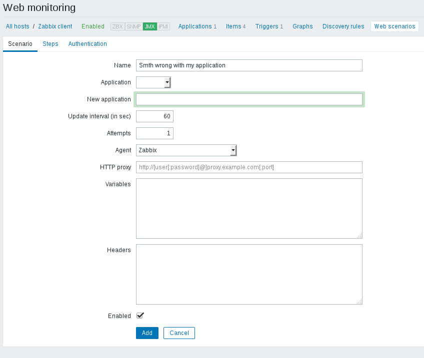
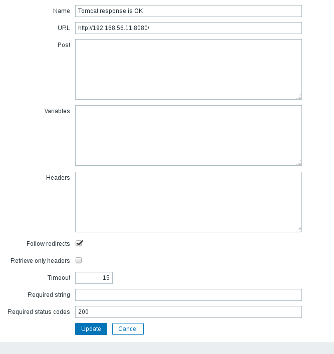
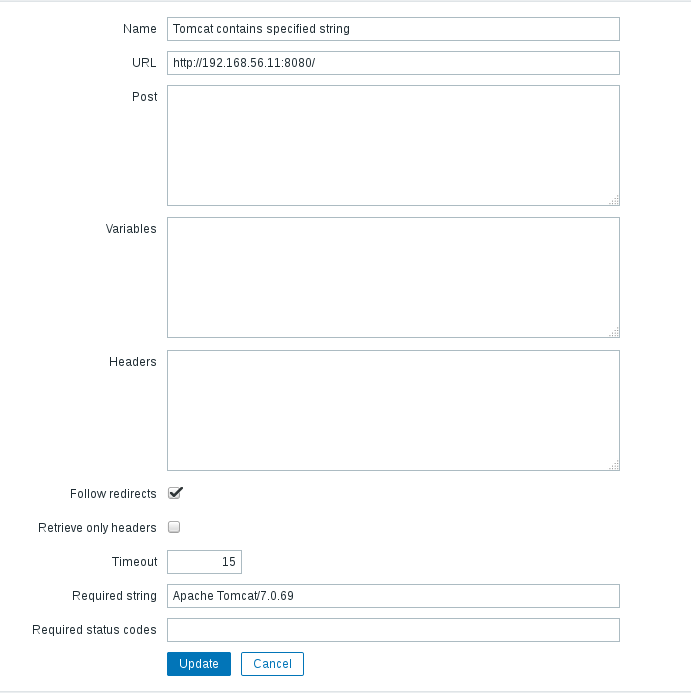
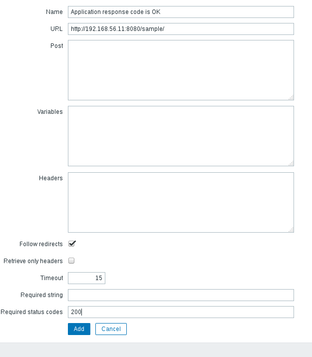
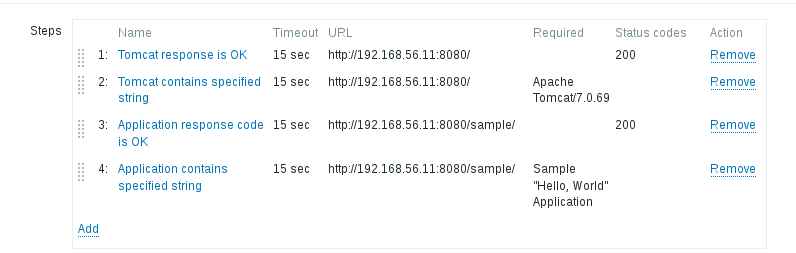
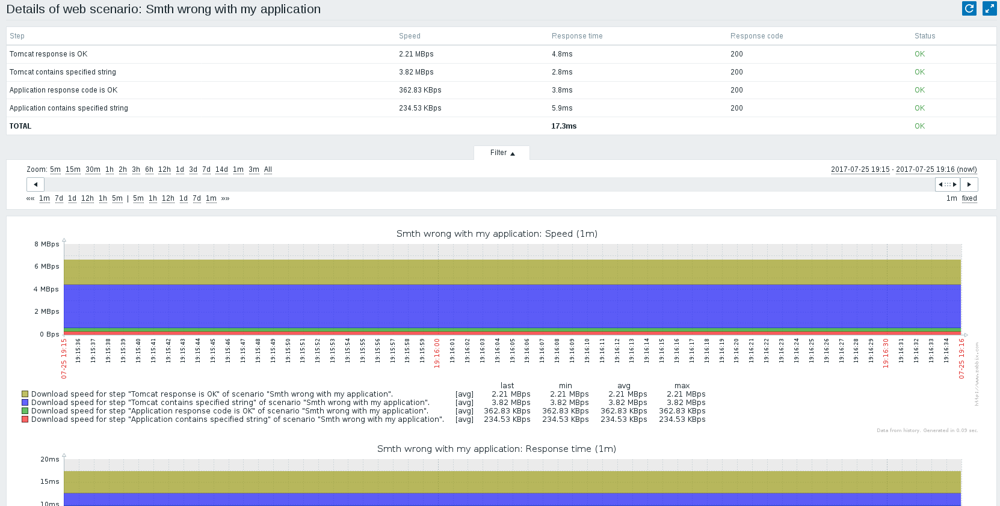
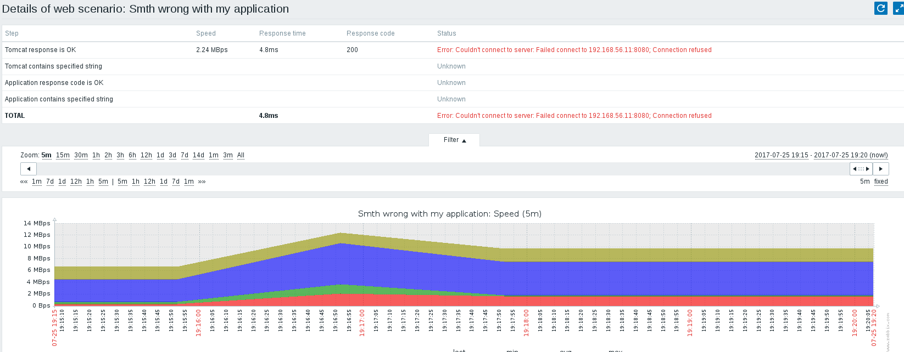
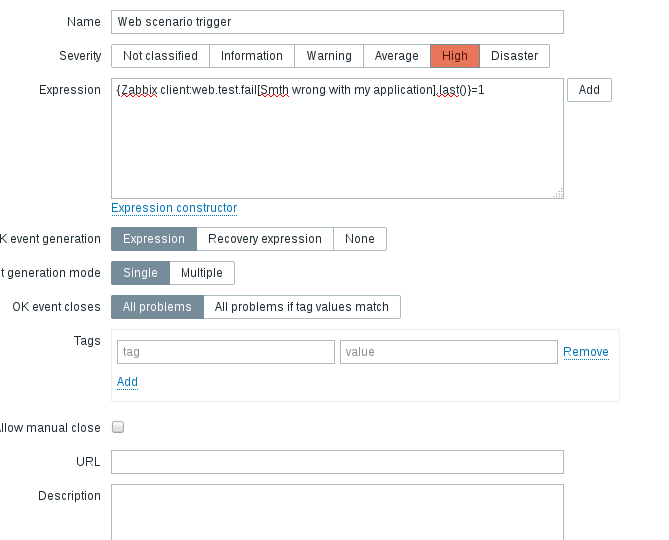
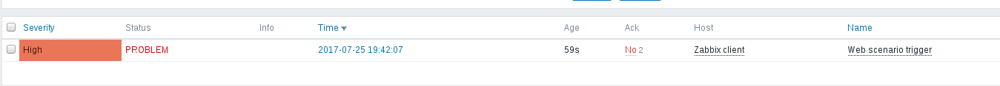

##  Task 1 - Zabbix JAVA:
- Configure Zabbix to examine Java parameters via Java Gateway

*vim /usr/share/tomcat/conf/tomcat.conf*

*vim /usr/share/tomcat/conf/server.xml*

- Configure triggers to alert once these parameters changed.

##  Task 2 - Web Monitoring with Zabbix:
- Scenario to test Tomcat availability as well as Application heath

*after stop tomcat*

- Configure Triggers to alert once WEB resources become unavailable

*systemctl stop tomcat*

##  Task 3 - Zabbix API:

- Starts at VM startup or on provision phase

- Host registered in Zabbix server should have Name = Hostname (not IP)

- Host registered in Zabbix server should belong to ”CloudHosts” group

- Host registered in Zabbix server should be linked with Custom template

- This script should create group “CloudHosts” id it doesn’t exist

# Result script
 [a link](https://github.com/SuperBazis/zabbix-tasks/blob/atsuranauD2/day2/scripts/zabbixregistration.py)

