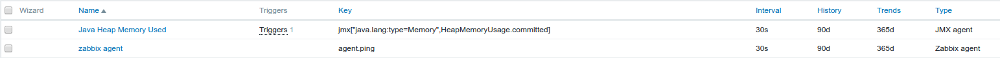
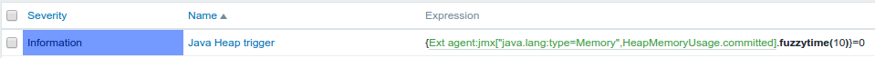
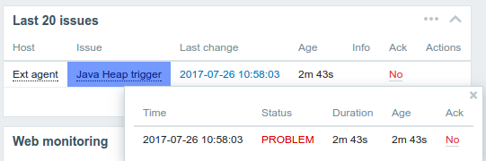
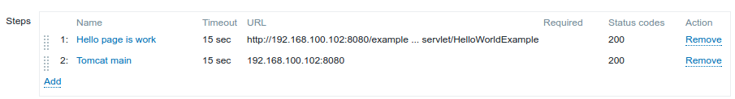
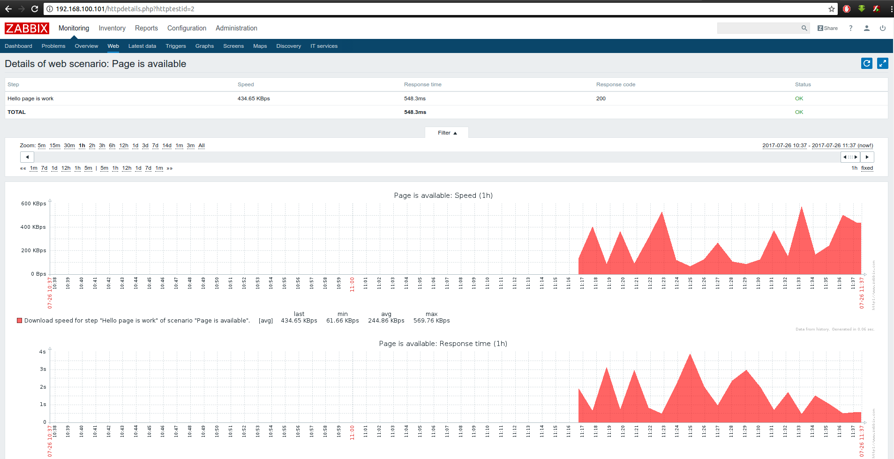
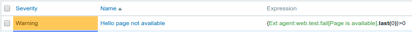
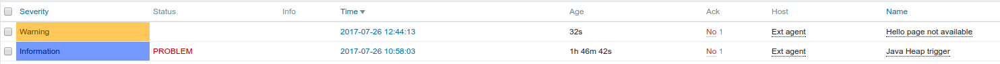

# Report here
## Task. Java Monitoring with Java
Configure Zabbix to examine Java parameters via JavaGateway  

Configure triggers to alert once these parameters changed.  
For both VMs use vagrant box “sbeliakou/centos-7.3-x86_64-minimal”  

## Task. Web Monitoring with Zabbix
Scenario to test Tomcat availability as well as Application heath  

Configure Triggers to alert once WEB resources become unavailable  
For both VMs use vagrant box “sbeliakou/centos-7.3-x86_64-minimal”  

## Task. Zabbix API

Solution in pyScript.py  

