## Task. Java Monitoring with Java

**Task:**  
You should install and configure Zabbix server and agents.  
Testing Infrastructure:  
  Vagrantfile to spin up 2 VMs (virtualbox):  
   - Zabbix server, provisioned by Vagrant provisioner  
   - Zabbix agents on both VMs, provisioned by Vagrant provisioner  
   - Install Tomcat 7 on 2nd VM  

**Tasks:**
  * Configure Zabbix to examine Java parameters via Java Gateway (http://jmxmonitor.sourceforge.net/jmx.html)  
  /usr/share/tomcat/conf/tomcat.conf:  
  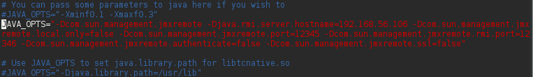
  
  /usr/share/tomcat/conf/server.xml:  
  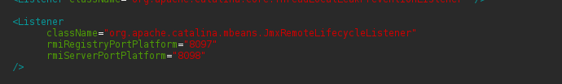
  
  ps -ef | grep tomcat:  
  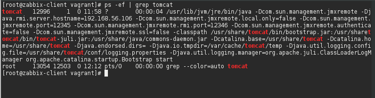
  
  checking with jmxterm:  
  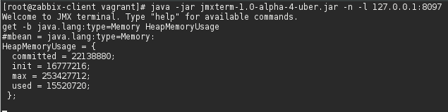
  
  after installing zabbix-java-gateway
  /etc/zabbix/zabbix_server.conf:  
  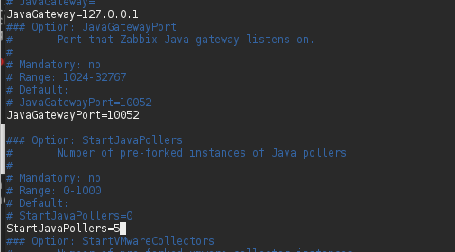
 
 configuring host and adding items:  
   
 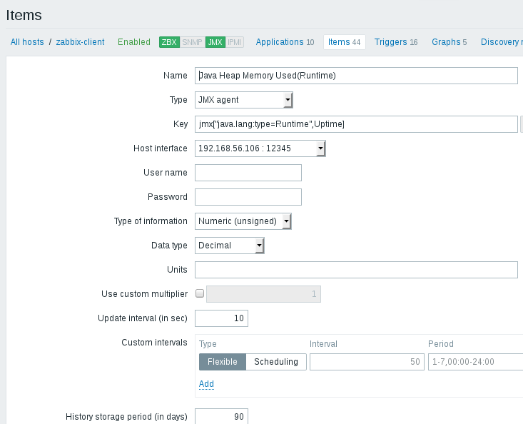
 
 result:  
 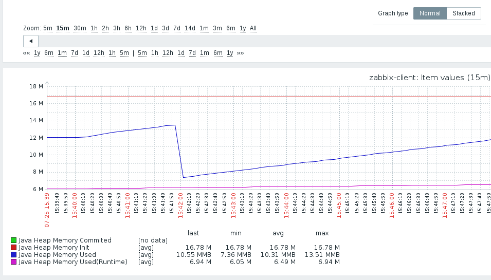
  
  * Configure triggers to alert once these parameters changed.
   
 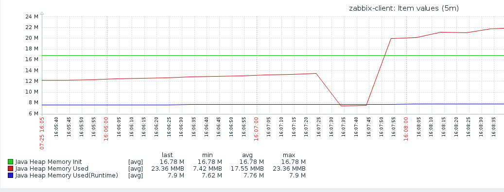  
 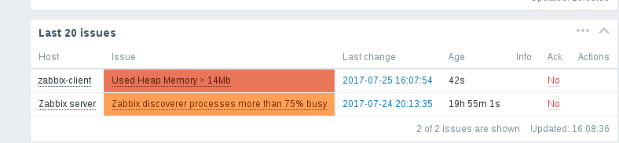  
 
## Task. Web Monitoring with Zabbix

**Testing Infrastructure:**  

  Vagrantfile to spin up 2 VMs (virtualbox):  
    -zabbix server, provisioned by Vagrant provisioner  
    -Zabbix agents on both VMs, provisioned by Vagrant provisioner  
  Install Tomcat 7 on 2nd VM, deploy any “hello world” application  
  
 **Tasks:**
  * Configure WEB check:  
  Scenario to test Tomcat availability as well as Application heath  
  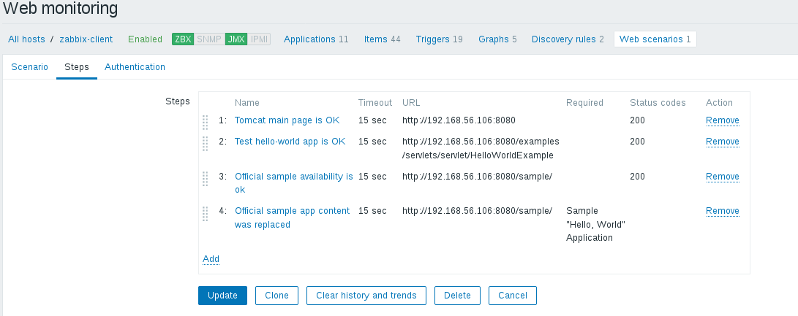  
  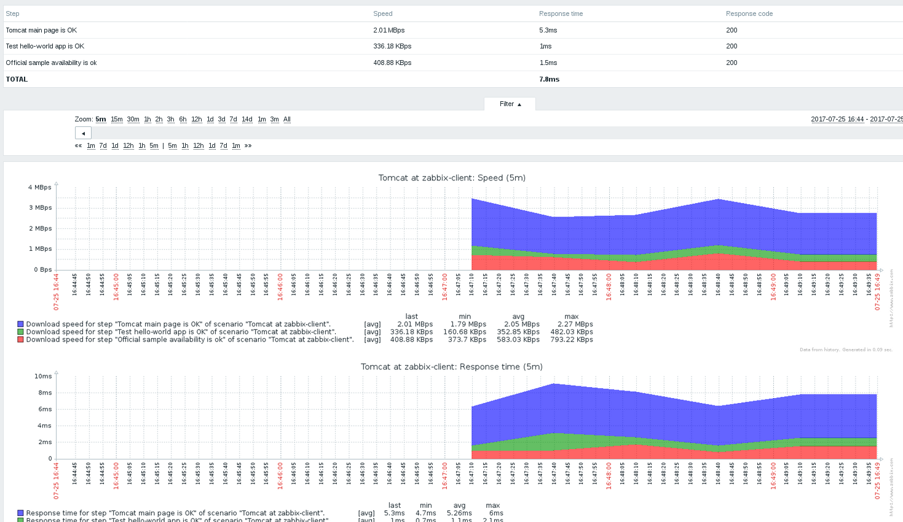  
  
  * Configure Triggers to alert once WEB resources become unavailable  
  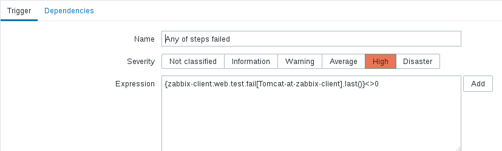
  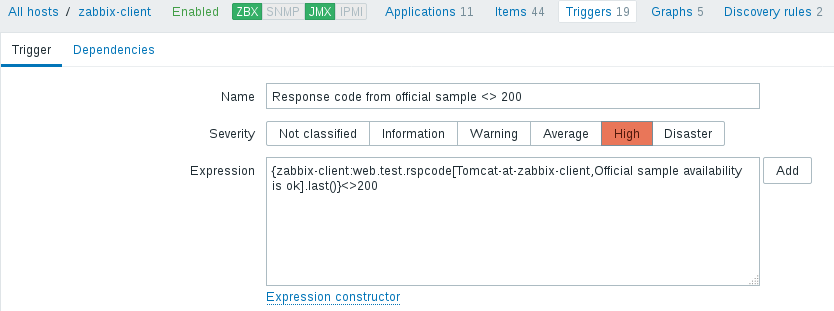   
  
  after undeploying sample app:  
  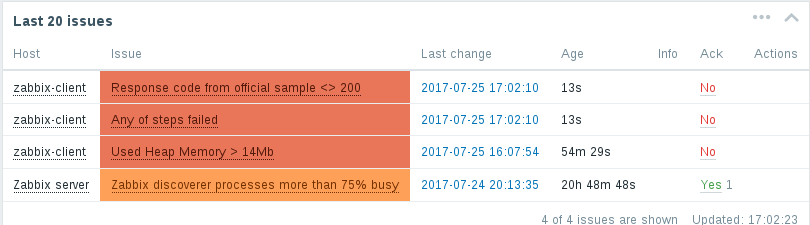
  
  
  
  
  

 
