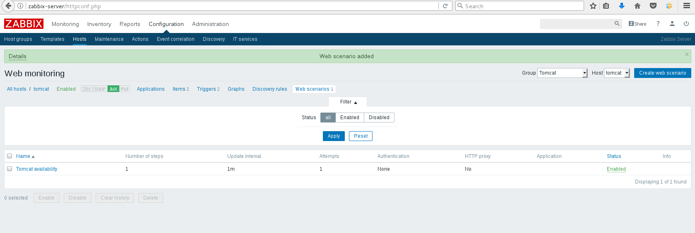

# Task1
1. Configure Zabbix to examine Java parameters via Java Gateway

2. Configure triggers to alert once these parameters changed.

# Task2

1. Configure WEB check:
Scenario to test Tomcat availability as well as Application heath

2. Configure Triggers to alert once WEB resources become unavailable

# Task3

* Host registered in Zabbix server should have Name = Hostname (not IP)
* Host registered in Zabbix server should belong to ”CloudHosts” group
* Host registered in Zabbix server should be linked with Custom template
* This script should create group “CloudHosts” id it doesn’t exist

