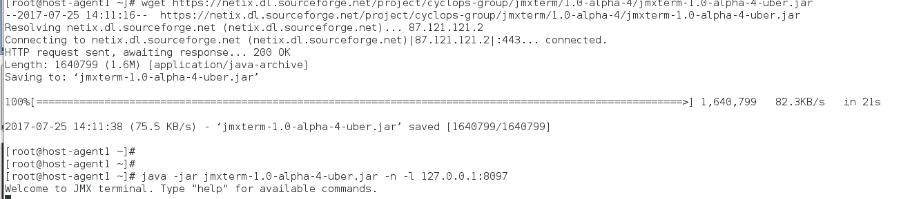

##  Task 1 - Zabbix JAVA:
- Configure Zabbix to examine Java parameters via Java Gateway

*vim /usr/share/tomcat/conf/tomcat.conf*

*vim /usr/share/tomcat/conf/server.xml*

- Configure triggers to alert once these parameters changed.

