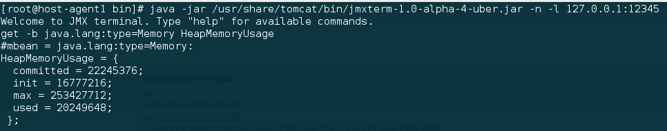

# Task. Java Monitoring with Java  
### Task:  
   You should install and configure Zabbix server and agents.  
### Testing Infrastructure:   
   [Vagrantfile](https://github.com/akonchyts/zabbix-tasks/blob/akonchyts/day2/Vagrantfile) to spin up 2 VMs (virtualbox):
  * *zabbix server, provisioned by Vagrant provisioner* - see [server.sh](https://github.com/akonchyts/zabbix-tasks/blob/akonchyts/day2/scripts/server.sh)  
  * *Zabbix agents on both VMs, provisioned by Vagrant provisioner* - see [agent.sh](https://github.com/akonchyts/zabbix-tasks/blob/akonchyts/day2/scripts/agent.sh)  
  * *Install Tomcat 7 on 2nd VM* - see [agent.sh](https://github.com/akonchyts/zabbix-tasks/blob/akonchyts/day2/scripts/agent.sh)  
    
### Tasks:
**1.** Configure Zabbix to examine Java parameters via Java Gateway (http://jmxmonitor.sourceforge.net/jmx.html)  
   *Tomcat works with next JVM opts*  
   
   
   *Tomcat jmx port works*  
   
   
   *JVM jmx port works*  
   
   
   *Create host host-agent1 with JMX interface*    
   
   
   *Create item 1 for host-agent1*     
   
   
   *Create item 2 for host-agent1*     
   
   
   *Create item 3 for host-agent1*     
   
   
   *Items for host-agent1 works*     
   
   
**2.** Configure triggers to alert once these parameters changed.  
   *Create trigger for item 3 of host-agent1*     
   
   
   *Create trigger for item 1 of host-agent1*     
   
   
   *Cneck that triggers works*     
   
   
   
   
   
   
   

# Task. Web Monitoring with Zabbix  
### Testing Infrastructure:  
   [Vagrantfile](https://github.com/akonchyts/zabbix-tasks/blob/akonchyts/day2/Vagrantfile) to spin up 2 VMs (virtualbox):  
  * *zabbix server, provisioned by Vagrant provisioner* - see [server.sh](https://github.com/akonchyts/zabbix-tasks/blob/akonchyts/day2/scripts/server.sh)  
  * *Zabbix agents on both VMs, provisioned by Vagrant provisioner* - see [agent.sh](https://github.com/akonchyts/zabbix-tasks/blob/akonchyts/day2/scripts/agent.sh)  
  * *Install Tomcat 7 on 2nd VM, deploy any “hello world” application* - see [agent.sh](https://github.com/akonchyts/zabbix-tasks/blob/akonchyts/day2/scripts/agent.sh)  

### Tasks:
**1.** Configure WEB check:  
*  *Scenario to test Tomcat availability as well as Application heath*  
   *Create web scenario*  
   
   
   
   
   
   
   
   *Check that web scenario works*  
   
   

**2.** Configure Triggers to alert once WEB resources become unavailable  
   *Create trigger for web scenario*  
    
    
    *Check that trigger works*  
    
    
    *Create trigger for web scenario*  
    
    
    

# Task. Zabbix API  
### Task:  
   You should develop a script (on Python 2.x) which registers given host in Zabbix.  

### Testing Infrastructure:  
   [Vagrantfile](https://github.com/akonchyts/zabbix-tasks/blob/akonchyts/day2/Vagrantfile) to spin up 2 VMs (virtualbox):  
  * *zabbix server, provisioned by Vagrant provisioner* - see [server.sh](https://github.com/akonchyts/zabbix-tasks/blob/akonchyts/day2/scripts/server.sh)  
  * *Linux VM with zabbix agent, script for registration on zabbix server, all provisioned by Vagrant provisioner* - see [agent.sh](https://github.com/akonchyts/zabbix-tasks/blob/akonchyts/day2/scripts/agent.sh) and Python script [zabbix.py](https://github.com/akonchyts/zabbix-tasks/blob/akonchyts/day2/scripts/zabbix.py)  

### Registering Script requirements:  
  * *Written on Python 2.x*  
  * *Starts at VM startup or on provision phase*  
  * *Host registered in Zabbix server should have Name = Hostname (not IP)*  
  * *Host registered in Zabbix server should belong to ”CloudHosts” group*  
  * *Host registered in Zabbix server should be linked with Custom template*  
  * *This script should create group “CloudHosts” id it doesn’t exist*  
  
Check taht python script zabbix.py works

