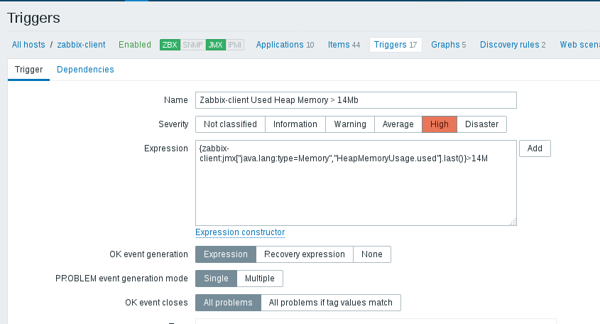

## Task. Java Monitoring with Java

**Task:**  
You should install and configure Zabbix server and agents.  
Testing Infrastructure:  
  Vagrantfile to spin up 2 VMs (virtualbox):  
   - Zabbix server, provisioned by Vagrant provisioner  
   - Zabbix agents on both VMs, provisioned by Vagrant provisioner  
   - Install Tomcat 7 on 2nd VM  

**Tasks:**
  * Configure Zabbix to examine Java parameters via Java Gateway (http://jmxmonitor.sourceforge.net/jmx.html)  
  /usr/share/tomcat/conf/tomcat.conf:  
  

  /usr/share/tomcat/conf/server.xml:  
  

  ps -ef | grep tomcat:  
  

  checking with jmxterm:  
  

  after installing zabbix-java-gateway
  /etc/zabbix/zabbix_server.conf:  
  

 configuring host and adding items:  
   
 

 result:  
 

  * Configure triggers to alert once these parameters changed.
   
   
   

## Task. Web Monitoring with Zabbix

**Testing Infrastructure:**  

  Vagrantfile to spin up 2 VMs (virtualbox):  
    -zabbix server, provisioned by Vagrant provisioner  
    -Zabbix agents on both VMs, provisioned by Vagrant provisioner  
  Install Tomcat 7 on 2nd VM, deploy any “hello world” application  

 **Tasks:**
  * Configure WEB check:  
  Scenario to test Tomcat availability as well as Application heath  
    
    

  * Configure Triggers to alert once WEB resources become unavailable  
  
     

  after undeploying sample app:  
  

## Task. Zabbix API
**Task:**
  * You should develop a script (on Python 2.x) which registers given host in Zabbix.

**Testing Infrastructure:**  

Vagrantfile to spin up 2 VMs (virtualbox):  
    - zabbix server, provisioned by Vagrant provisioner
    - Linux VM with zabbix agent, script for registration on zabbix server, all provisioned by Vagrant provisioner

**Registering Script requirements:**  

  - Written on Python 2.x  
  - Starts at VM startup or on provision phase  
  - Host registered in Zabbix server should have Name = Hostname (not IP)  
  - Host registered in Zabbix server should belong to ”CloudHosts” group  
  - Host registered in Zabbix server should be linked with Custom template  
  - This script should create group “CloudHosts” if it doesn’t exist  
  - For both VMs use vagrant box “sbeliakou/centos-7.3-x86_64-minimal”  

##task scripts:  
python script for this task is [here](scripts/add_host.py)
Vagrantfile is [here](Vagrantfile)
bash scripts for server and client are [here](scripts/server.sh) and [here](scripts/client.sh)
