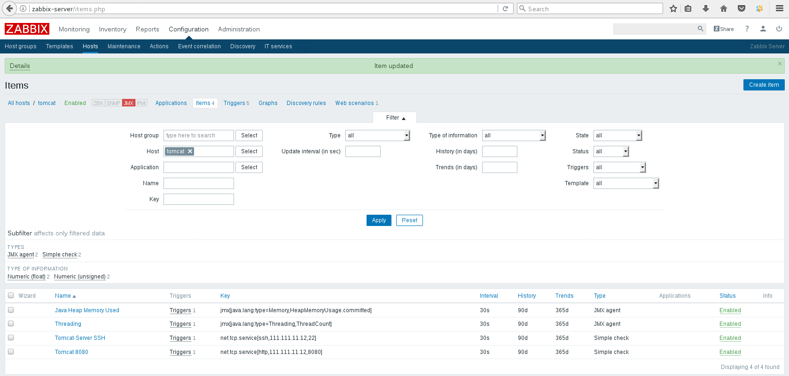
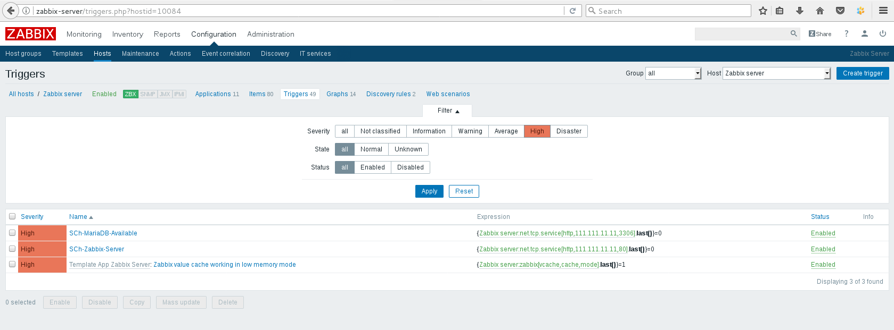
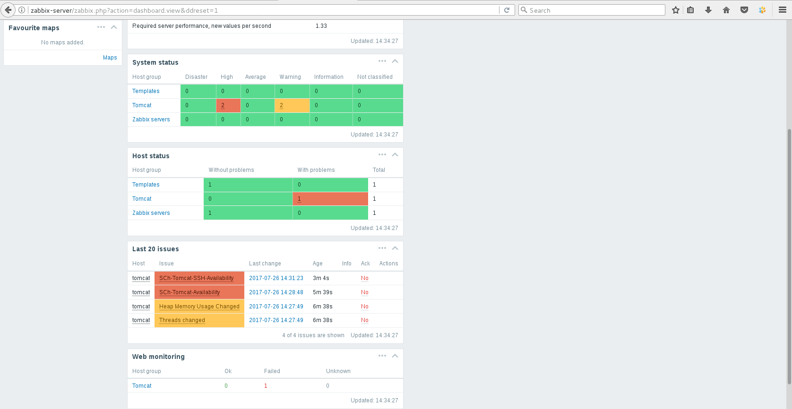
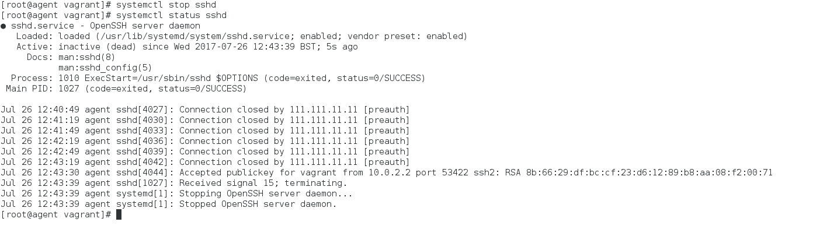
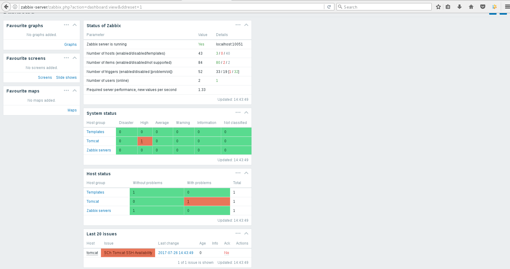

# Task1

__1. Simple checks:__
* Zabbix Server WEB availability (80)
* Zabbix DB is available (3306)
* Tomcat availability (80, 8080)
* Tomcat Server is available by ssh (22)

__The result (tomcat only):__
* for full down of virtual host command:

* **sshd** daemon down only:

