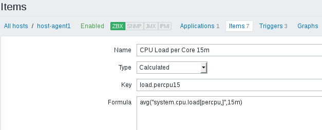
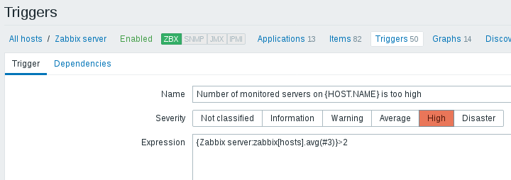

# Task. Items
### Task:
   Assuming we have 2 servers (VMs) – ZabbixServer and Tomcat (see [Vagrantfile](https://github.com/akonchyts/zabbix-tasks/blob/akonchyts/day3/Vagrantfile), see [server.sh](https://github.com/akonchyts/zabbix-tasks/blob/akonchyts/day3/server.sh), see [agent.sh](https://github.com/akonchyts/zabbix-tasks/blob/akonchyts/day3/agent.sh))  

### Configure checks and triggers for every check:  
### **1.** Simple checks:  
   *Zabbix Server WEB availability (80) and trigger for it*  
     
   
     
   
   *Zabbix DB is available (3306) and trigger for it*  
     
   
     
   
   *Tomcat availability (80) and trigger for it*  
     
   
     
   
   *Tomcat availability (8080) and trigger for it* 
     
   
     
   
   *Tomcat Server is available by ssh (22) and trigger for it*  
     
   
     

####   Check that simple checks and triggers for them work for:
     
   
   *Zabbix Server WEB unavailability (80) trigger*  
     
   
   *Tomcat unavailability (80,8080) triggers*  
     
   
   
### **2.** Calculated Checks:  
   *CPU Load per Core (1, 5, 15min) and triggers for them*  
     
     
   
     
     
   
     
     
   
#### Check that calculated checks and triggers for them work:  
     
   
     
   
   
### **3.** Internal Checks:
   *How many items are enabled and trigger for it*  
     
   
     
   
   *How many Servers are being monitored and trigger for it*  
     
   
     
   
#### Check that internal checks and triggers for them work:  
     
   
     
   
  
### **4.** Create item and custom trigger for log monitoring (you can use httpd or tomcat logs)  
   *Create item for log monitoring and trigger for it*  
     
   
     

#### Check that item for log monitoring and trigger for it work:  
     
   
     

# Task. Operations  
### Task:  
   Configure Custom graphs and screens of your infrastructure:  
   2 VMS, Zabbix Server and Tomcat Server  
   
   *Create next items and check that they work*  
     
   
     
   
   *Create next graphs and check them*  
     
   
     
   
     
   
     
   
     
   
   *Create screen for Zabbix Server and Tomcat Server*  
     
   
   *Create screen for Tomcat Server (host-agent1)*  
     

