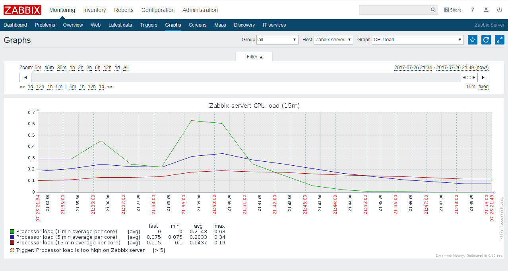

# Task1

__1. Simple checks:__
* Zabbix Server WEB availability (80)
* Zabbix DB is available (3306)
* Tomcat availability (80, 8080)
* Tomcat Server is available by ssh (22)

__The result (tomcat only):__
* for full down of virtual host command:

* **sshd** daemon down only:

__2. Calculated Checks:__

* CPU load per cpu in **%**

__3. Internal Checks:__

* How many items are enabled
* How many Servers are being monitored

* Triggers:

# Task2
__Graphs__

* Zabbix CPU (default)

* Tomcat availability (custom)

* Tomcat threads (custom)

