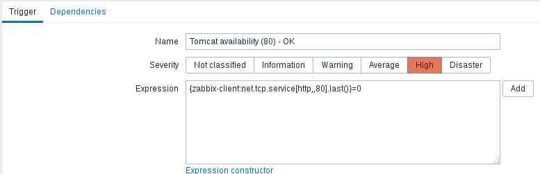

## Task. Logfile monitoring

**Task:**
  * Create item and develop custom trigger for log monitoring (you can use httpd or tomcat logs)  
    
    

  * Create a trigger for errors in log file monitored by that item  
    
  

## Task. Items

**Task:**  
Assuming we have 2 servers (VMs) – ZabbixServer and Tomcat.  
Configure:
### 1. Simple checks:
  * Zabbix Server WEB availability (80)  

  

  * Zabbix DB is available (3306)  
  

  * Tomcat availability (80, 8080)  
  
  

  * Tomcat Server is available by ssh (22)  
  

### 2. Calculated Checks:
  * CPU Load per Core (1, 5, 15min)
    
    
    

### 3. Internal Checks:
  * How many items are enabled
  

  * How many Servers are being monitored
  

### Create triggers for every check  

 Zabbix Server WEB availability (80)  
    

  Zabbix DB is available (3306)  

    

  Tomcat availability (80)  
    

  Tomcat availability (8080)  
    

  Tomcat Server is available by ssh (22)  
  

  Average CPU load per core (for 1, 5, 15 minutes)  
  
  
  

  Count active items changed  
  

  Count of monitored hosts changed  
  

### Example of triggering:  

## Task. Operations

**Task:**
Configure Custom graphs and screens of your infrastructure:  
2 VMS, Zabbix Server and Tomcat Server

