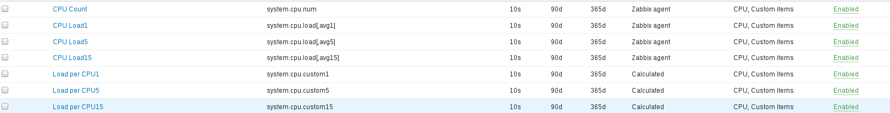
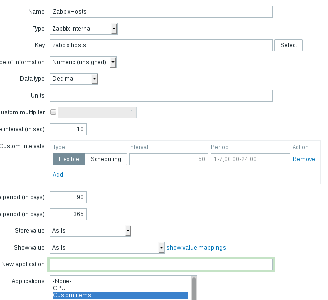
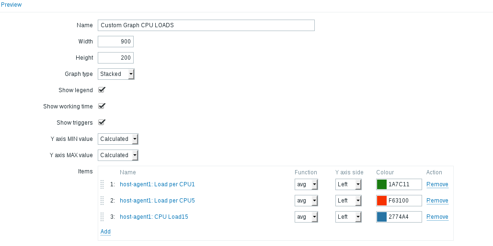

##  Task 1 - Zabbix Items:
###  Simple checks:
- Zabbix Server WEB availability (80)

- Zabbix DB is available (3306)

- Tomcat availability (80, 8080)

- Tomcat Server is available by ssh (22)

###  Calculated Checks:
- CPU Load per Core (1, 5, 15min)

*after stress –cpu 4 –timeout 60*

###  Internal Checks:
- How many items are enabled

- How many Servers are being monitored

###  Create triggers for every check

###  Create item and develop custom trigger for log monitoring (you can use httpd or tomcat logs)

###  Create a trigger for errors in log file monitored by that item

*after entering nonexistent address*

*after 30 seconds*

##  Task 2 - Zabbix Operations:

